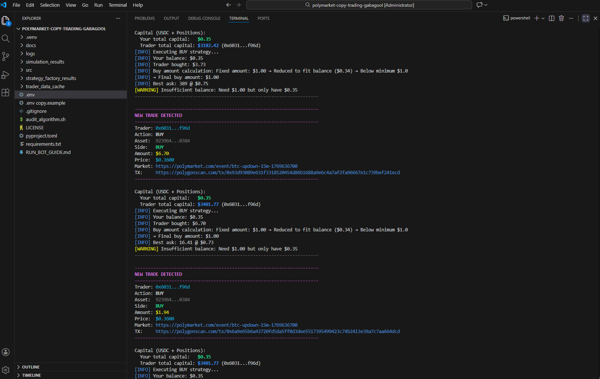
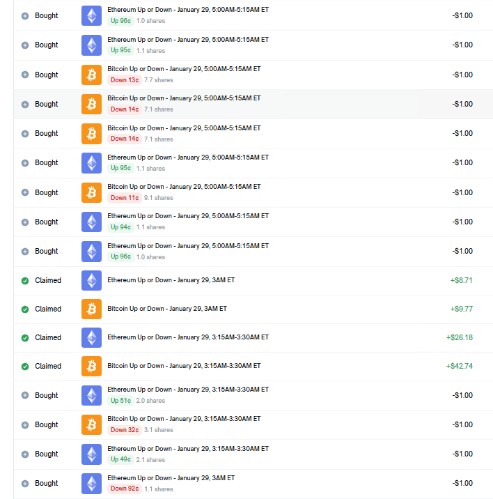
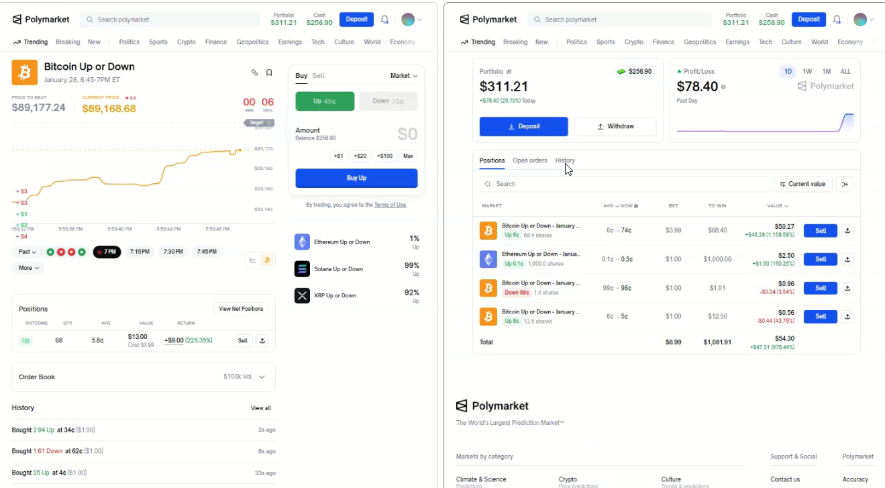
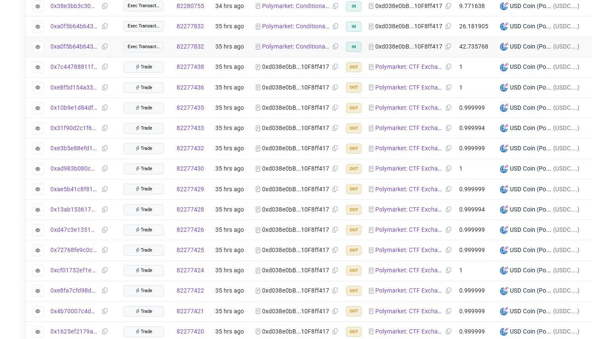

# Polymarket Bot | Polymarket Trading Bot | Polymarket Copy Trading Bot  

> **Automated Polymarket copy trading bot that mirrors top traders in real time**  
> **Live tested • Profitable • Real on-chain execution**

**🔍 Search Keywords:** `polymarket bot`, `polymarket trading bot`, `polymarket copy trading bot`, `polymarket copy trading`, `automated polymarket trading`, `polymarket trading automation`, `polymarket prediction markets bot`, `best polymarket bot`, `top polymarket trading bot`

> **Need help running this project or want an updated version?**  
> 📱 **Telegram**: [t.me/dexoryn_here](https://t.me/dexoryn_here) 
---

## 🎥 Live Profit Videos : **Copy trading Gabagool22**  

@gabagool22 address: 0x6031b6eed1c97e853c6e0f03ad3ce3529351f96d  

*(I also attached videos for transparency.)*

### Video 1 — Live Copy Trading Run

<video width="100%" controls>
  <source src="videos/1.Dexoryn%20Labs%20Crypto%20casino%20+%20Trading%20bot%20development.mp4" type="video/mp4">
  Your browser does not support the video tag.
</video>

- **+$80 profit in ~15 minutes**
- Bot ran unattended during this session
- Real on-chain execution, not simulation

### Video 2 — Second Run to confirm performance 

<video width="100%" controls>
  <source src="videos/2.Dexoryn%20Labs%20Crypto%20casino%20+%20Trading%20bot%20development%202.mp4" type="video/mp4">
  Your browser does not support the video tag.
</video>


- **Additional +$230 profit in next 15 mins**
- Same bot, same logic, separate run
- Fully automated copy trading
---
Unlike other Polymarket bots that only show screenshots or claim to be "running," this Polymarket trading bot has **real profit videos** demonstrating actual on-chain execution and profitability. This is proof of a working Polymarket copy trading bot that generates real profits.

## 📖 Live Test Story (Real Usage)

**After updating the bot, I ran it to test the new logic and left it running while I went out to play billiards with friends.**

**About one hour later, when I returned:**

- ✅ The bot was running normally
- ✅ It was copy trading accurately
- ✅ Trades matched the target trader's transactions
- ✅ The bot had already generated profit

**This was a fully unattended live run, not a simulation or backtest.**

---

## ⭐ Why This Bot is "Better" than Other's

### 📸 Screenshots

<table>
  <tr>
    <td align="center">
      
    </td>
    <td align="center">
      
    </td>
  </tr>
  <tr>
    <td align="center">
      
    </td>
    <td align="center">
      
    </td>
  </tr>
</table>

### 🎯 **Real Profit Proof, Not Just Claims**

While other Polymarket bots show screenshots or claim profitability, **this Polymarket trading bot has actual video proof** of live trading sessions generating real profits. See the demonstration videos above for transparent proof of profitability.

### 🚀 **Superior Architecture & Performance**

- **Optimized folder structure** - Centralized data management (`data/` directory) for better performance and organization
- **Async-first design** - Built on Python's `asyncio` for maximum efficiency and low latency
- **Smart caching system** - Intelligent data caching reduces API calls and improves response times
- **Modular codebase** - Clean separation of concerns enables easy maintenance and extensibility

### 💡 **Advanced Features You Won't Find Elsewhere**

- **Trade aggregation** - Combines multiple small trades into larger executable orders (reduces gas costs significantly)
- **Tiered multipliers** - Apply different position sizing multipliers based on trade size for optimal risk management
- **Comprehensive analytics** - Built-in simulation engine, backtesting, and performance auditing tools
- **Multi-trader support** - Track and copy from multiple traders simultaneously with independent strategies
- **Real-time monitoring** - Sub-second trade detection and execution (1-second polling interval)


### 📈 **Comparison Table**

| Feature | This Bot | Other Solutions |
|---------|----------|----------------|
| **Profit Proof** | ✅ Real video demonstrations | ❌ Screenshots only or claims |
| **Trade Aggregation** | ✅ Combines trades to reduce gas | ❌ Executes individually |
| **Tiered Multipliers** | ✅ Advanced position sizing | ❌ Fixed multipliers only |
| **Simulation Engine** | ✅ Built-in backtesting | ❌ No testing tools |
| **Data Organization** | ✅ Centralized `data/` structure | ❌ Scattered files |
| **Multi-Trader Support** | ✅ Independent strategies | ⚠️ Limited support |
| **Performance Auditing** | ✅ Algorithm validation | ❌ No auditing tools |
| **Comprehensive Analytics** | ✅ Full research suite | ⚠️ Basic features only |
| **Code Architecture** | ✅ Modular & extensible | ⚠️ Monolithic design |
| **Live Testing** | ✅ Unattended runs with profit | ⚠️ No proof of profitability |

---

## 🎯 Who This Bot Is For

### ✔ **Perfect For:**

- **Polymarket traders seeking passive exposure** - Automatically mirror top traders without manual intervention
- **Users comfortable running Python scripts** - Technical knowledge required for setup and configuration
- **Traders who understand on-chain risk** - Awareness of blockchain risks and gas fees
- **Serious traders looking for proven solutions** - Want real profit proof, not just claims

### ❌ **Not For:**

- **Beginners expecting guaranteed profits** - Trading involves risk; past performance doesn't guarantee future results
- **"Set and forget forever" money printer seekers** - Requires monitoring and understanding of markets
- **Risk-averse investors** - All trading involves risk of capital loss

---

## Quick Start | Get Started with Your Polymarket Bot

### Prerequisites

Before setting up your Polymarket bot (Polymarket trading bot), ensure you have:

- **Python 3.10+** - Modern Python for optimal performance
- **MongoDB database** - [MongoDB Atlas](https://www.mongodb.com/cloud/atlas/register) free tier works perfectly
- **Polygon wallet** - Wallet with USDC for trading and POL/MATIC for gas fees
- **RPC endpoint** - Polygon RPC endpoint from [Infura](https://infura.io) or [Alchemy](https://www.alchemy.com) (free tier available)

### Installation

```bash
# Clone repository
git clone https://github.com/dexorynLabs/polymarket-copy-trading-bot-v2.0.git
cd polymarket-copy-trading-bot-v2.0

# Install dependencies
pip install -r requirements.txt

# Run interactive setup wizard
python -m src.scripts.setup.setup

# Verify system status
python -m src.scripts.setup.system_status

# Start trading bot
python -m src.main
```

**💡 Need help?** Contact [@dexoryn_here](https://t.me/dexoryn_here) on Telegram for Polymarket bot setup assistance or updated Polymarket trading bot versions.

---

## Configuration

### Essential Variables

Create a `.env` file with the following variables:

| Variable | Description | Example |
|----------|-------------|---------|
| `USER_ADDRESSES` | Traders to copy (comma-separated) | `'0xABC..., 0xDEF...'` |
| `PROXY_WALLET` | Your Polygon wallet address | `'0x123...'` |
| `PRIVATE_KEY` | Wallet private key (no 0x prefix) | `'abc123...'` |
| `MONGO_URI` | MongoDB connection string | `'mongodb+srv://...'` |
| `RPC_URL` | Polygon RPC endpoint | `'https://polygon...'` |
| `USDC_CONTRACT_ADDRESS` | USDC contract on Polygon | `'0x2791Bca1f2de4661ED88A30C99A7a9449Aa84174'` |
| `CLOB_HTTP_URL` | Polymarket CLOB API URL | `'https://clob.polymarket.com'` |
| `TRADE_MULTIPLIER` | Position size multiplier (default: 1.0) | `2.0` |
| `FETCH_INTERVAL` | Check interval in seconds (default: 1) | `1` |
| `TRADE_AGGREGATION_ENABLED` | Enable trade aggregation (default: false) | `true` |
| `TRADE_AGGREGATION_WINDOW_SECONDS` | Aggregation window (default: 30) | `30` |


## Safety & Risk Management | Polymarket Copy Trading Best Practices

⚠️ **Critical Disclaimers for Polymarket Copy Trading:**

- **Use at your own risk** - This bot executes real trades with real money on Polymarket
- **Start small** - Test with minimal funds before scaling up your copy trading operations
- **Diversify strategies** - Don't copy just one trader; track multiple Polymarket traders simultaneously
- **Monitor regularly** - Check bot logs daily to ensure proper execution and catch issues early
- **No guarantees** - Past Polymarket performance doesn't guarantee future results
- **Understand markets** - Familiarize yourself with Polymarket prediction markets before trading
- **Risk management** - Never invest more than you can afford to lose

### Best Practices

1. Use a dedicated wallet separate from your main funds
2. Only allocate capital you can afford to lose
3. Research traders thoroughly before copying
4. Set up monitoring and alerts
5. Know how to stop the bot quickly (Ctrl+C)
6. Run system status check before starting: `python -m src.scripts.setup.system_status`

**💡 Need Help?** Contact [@dexoryn_here](https://t.me/dexoryn_here) on Telegram for Polymarket bot setup assistance or updated Polymarket trading bot versions.

## Author & Contact | Polymarket Bot Developer

### 👨‍💻 Dexoryn Labs - Professional Polymarket Bot Development Service

**Expert Polymarket Bot & Polymarket Trading Bot Solutions**

We specialize in building the most advanced **Polymarket bot**, **Polymarket trading bot**, and **Polymarket copy trading bot** solutions. This professional-grade Polymarket bot represents our commitment to creating efficient, reliable, and feature-rich trading automation tools for Polymarket prediction markets.

**Our Expertise:**
- ✅ Professional Polymarket bot development
- ✅ Advanced Polymarket trading bot architecture
- ✅ Custom Polymarket copy trading bot solutions
- ✅ Polymarket automation and trading strategies

---

### 📞 Get In Touch | Polymarket Bot Support

**Need help with your Polymarket bot? Want an updated Polymarket trading bot version? Have questions about Polymarket copy trading bot setup?**

**Reach out through any of these channels:**

- **💬 Telegram**: [@dexoryn_here](https://t.me/dexoryn_here) - *Fastest response for Polymarket bot support*
- **🐦 Twitter**: [@dexoryn](https://x.com/dexoryn) - *Follow for Polymarket trading bot updates*
- **💻 GitHub**: [@dexorynLabs](https://github.com/dexorynLabs) - *View Polymarket bot source code and contribute*

**Preferred Contact Method:** Telegram for quick Polymarket bot support and questions

---

## Contributing

Contributions are welcome! Please:

1. Fork the repository
2. Create a feature branch (`git checkout -b feature/amazing-feature`)
3. Commit your changes (`git commit -m 'Add amazing feature'`)
4. Push to the branch (`git push origin feature/amazing-feature`)
5. Open a Pull Request

## License

ISC License - See [LICENSE](LICENSE) file for details.

## ⚖️ Legal Disclaimer

**Trading on Polymarket involves significant risk of financial loss** 

- Past performance does not guarantee future results
- The developers (Dexoryn) are not responsible for any financial losses incurred while using this bot
- Users are solely responsible for their trading decisions and capital management
- Always comply with local regulations regarding automated trading and prediction markets

**Use this bot at your own risk and only with funds you can afford to lose.**

---

Running this Polymarket trading bot? Need help setting up your Polymarket copy trading bot? Want the latest updated version with enhanced features?

**Contact the developer for:**
- ✅ Setup assistance and configuration help
- ✅ Latest updated versions and new features
- ✅ Custom Polymarket bot development
- ✅ Polymarket trading bot optimization
- ✅ Bug fixes and technical support
- ✅ Advanced Polymarket copy trading bot features

**📞 Contact Information:**
- **💬 Telegram**: [@dexoryn_here](https://t.me/dexoryn_here) - *Fastest response for Polymarket bot support*
- **🐦 Twitter**: [@dexoryn](https://x.com/dexoryn) - *Follow for Polymarket trading bot updates*
- **💻 GitHub**: [@dexorynLabs](https://github.com/dexoryn) - *The programmer who made this bot*

**Preferred Contact:** Telegram for quick Polymarket bot support and questions

---

## 🌟 Star History & Community | Polymarket Bot Support

If you find this Polymarket bot, Polymarket trading bot, or Polymarket copy trading bot useful, please consider:

- ⭐ **Starring the repository** - Help others discover this Polymarket bot solution
- 🐛 **Reporting issues** - Help improve the Polymarket trading bot by reporting bugs
- 💡 **Suggesting features** - Share your ideas for new Polymarket bot features
- 🤝 **Contributing** - Submit pull requests to enhance the Polymarket copy trading bot

**Need help or updated version?** Contact [@dexoryn_here](https://t.me/dexoryn_here) on Telegram.

**Your support helps make Polymarket bot trading more accessible to everyone!**

---

**🔍 Search Terms:** This is the best Polymarket bot, top Polymarket trading bot, and most advanced Polymarket copy trading bot available. Looking for a Polymarket bot? This Polymarket trading bot is production-ready with real profit proof. Need a Polymarket copy trading bot? This is it.
